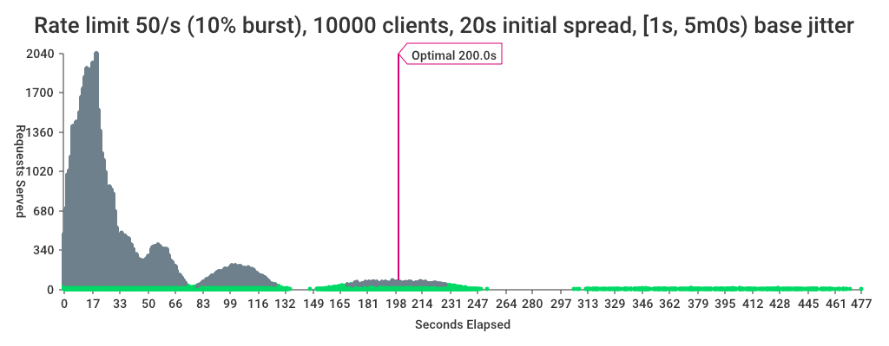
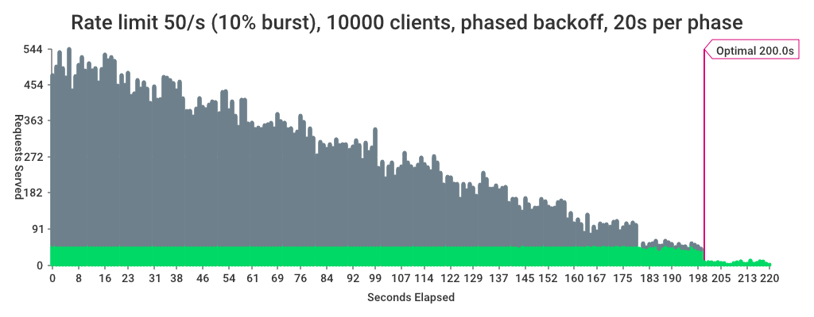
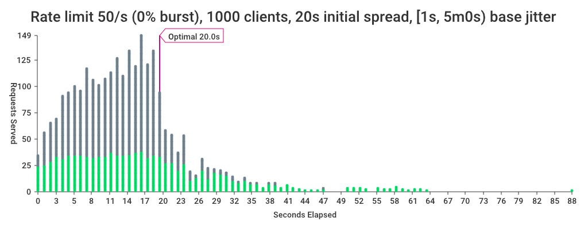
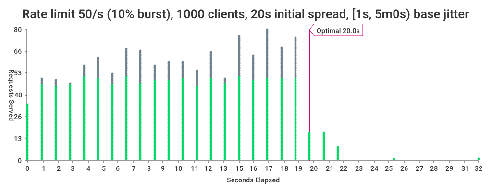

# Rate Limit and Backoff Sim

This was written to explore the parameters of a specific problem in Consul. It
could apply in many other cases however it's often likely that rate limits are
to prevent abuse rather than to control expected traffic patterns as is the case
here.

There are many possible improvements that could be made -- this was a quick tool
for a specific task. Displaying a legend in the charts was problematic without 
major investment so the green dots (at the bottom) are "success" requests after 
which that client terminates, while grey ones are "rate limited" requests. The 
request dots are "stacked" one y unit high making the hight of the stack the number 
of requests serveed for that 1-second bucket.

The main learning were:

 1. Exponential backoff is not necessarily the best choice when optimising for
    both total time for each client to get a successful request. In this case
    having each client only retry once per "window" with uniform random 
    selection within that window was much better for _both_ overall server 
    load and completion time.

    
    

 2. The burst setting on a leaky bucket rate limiter (e.g. golang.org/x/time/rate)
    is much more important than initially expected - Since I wanted a "hard"
    rate limit I set the burst to 1 initially but even with many many clients and random
    jitter the arrivals just aren't uniform enough and so fall foul of the rate
    limit far too often. The charts below show identical simulations other than with burst of 1 vs 10% (i.e. burst of 5).

    
    
